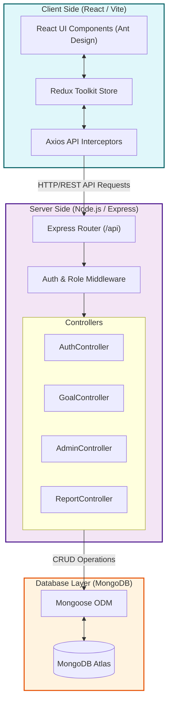
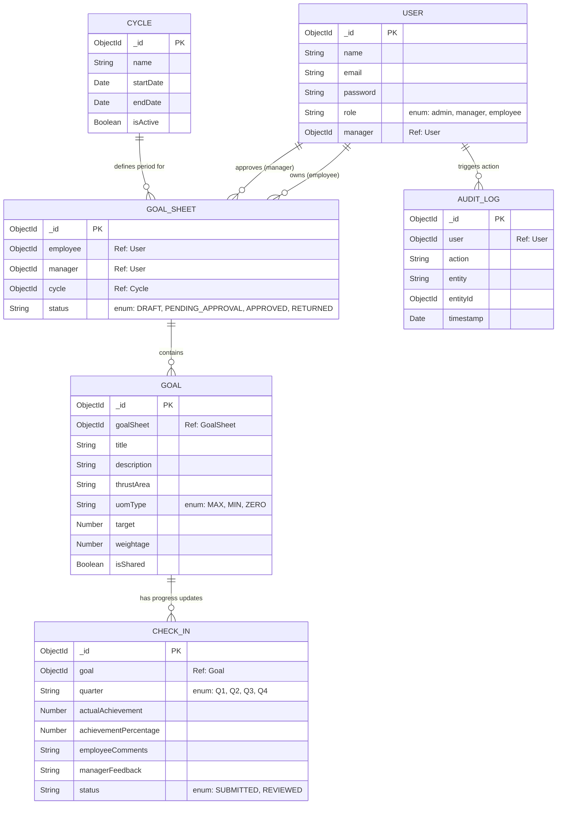
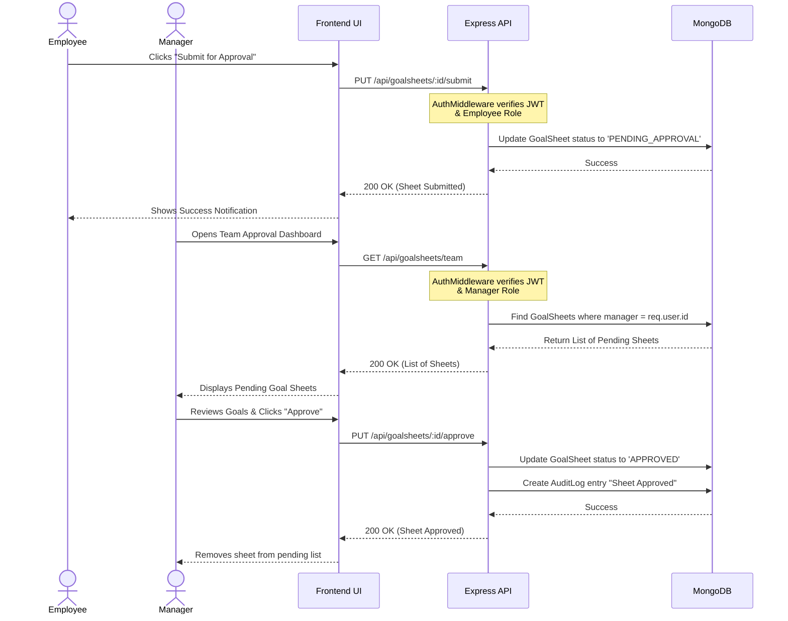

# GoalQuest Project Submission

## 1. Working Link
* **Live Deployment:** [INSERT YOUR VERCEL/DEPLOYMENT LINK HERE]

## 2. Source Code Repository
* **GitHub Repository:** [https://github.com/sakalesha/GoalQuest](https://github.com/sakalesha/GoalQuest)

## 3. Architecture Diagrams

### High-Level System Architecture

### Database Entity Relationship (ER) Diagram

### Core Business Logic Flow (Goal Creation & Approval)

