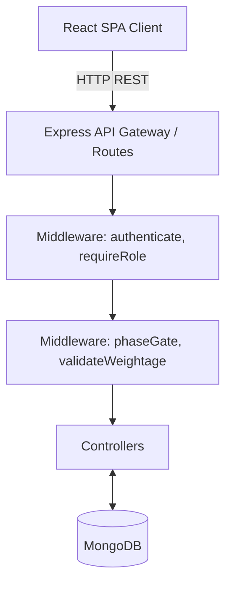
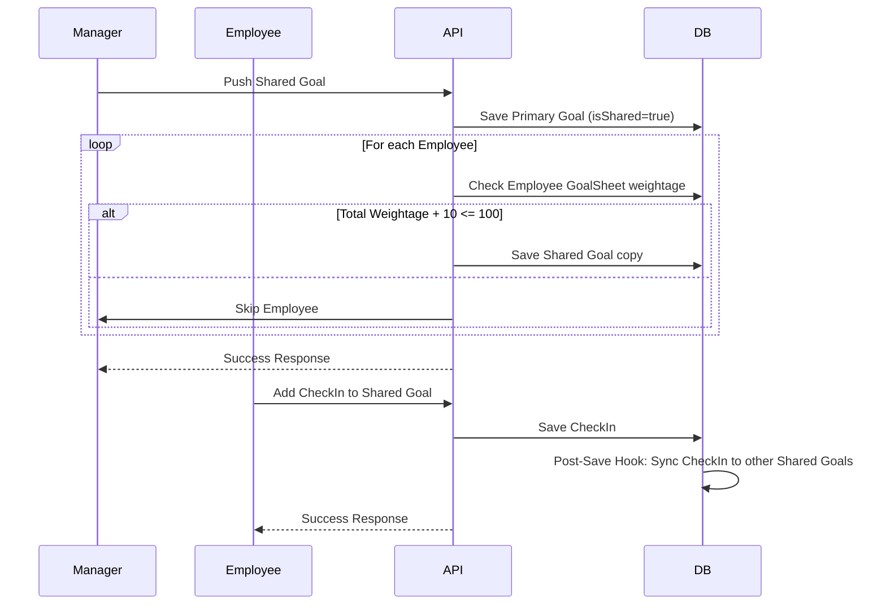

# GoalQuest Engineering Onboarding Document

Welcome to GoalQuest! This document is your comprehensive engineering handover guide. It is designed to teach you the entire system from the ground up, moving from high-level architecture to low-level implementation details, so you can safely and effectively contribute to the codebase.

---

## 1. Executive Summary

GoalQuest is a structured, digital Goal Setting & Tracking Portal designed to eliminate manual goal-tracking methods and support the full lifecycle of employee goals. 

In organizations relying on fragmented methods (like spreadsheets or emails), tracking goals causes blind spots for managers, confusion for employees, and logistical headaches for HR during appraisal time. GoalQuest solves this by providing a unified platform where goals are created, aligned, and tracked through quarterly check-ins. It supports a structured lifecycle including drafting, submission, manager approval, and phase-gated execution. The project is a mature, full-stack application with rigorous backend validation, Role-Based Access Control (RBAC), and integrated auditing to ensure accountability and transparency.

---

## 2. Big Picture Architecture

GoalQuest follows a modern Single Page Application (SPA) architecture with a Node.js/Express backend and a React frontend.

- **Client Application**: Built with React, Vite, Redux Toolkit, and Tailwind CSS. It handles the user interface and state management.
- **API Routes**: Express Router is used to separate domains (`auth`, `goals`, `goalSheets`, `checkIns`, `admin`, `reports`).
- **Middlewares**: Enforces security (`authenticate`, `requireRole`), business logic (`validateWeightage`), and time-based constraints (`phaseGate`).
- **Controllers**: Houses the core business logic, manipulating data models and handling HTTP responses.
- **Database**: MongoDB (via Mongoose) stores all entities with relational references (e.g., `ObjectId`).

---

## 3. Repository Walkthrough

- `/api/`
  - `index.ts`: Potential serverless entry point or alternative API gateway configuration (Vercel specific).
- `/backend/`
  - `/config/`: Contains constants and database connection logic (`db.js`, `constants.js`).
  - `/controllers/`: Houses the core business logic for each route (`authController.js`, `goalController.js`, etc.).
  - `/middleware/`: Contains custom Express middlewares (`authenticate.js`, `phaseGate.js`, `validateWeightage.js`).
  - `/models/`: Mongoose schemas defining the database structure (`User.js`, `Goal.js`, `Cycle.js`, etc.).
  - `/routes/`: Express route definitions connecting endpoints to controllers.
  - `/utils/`: Helper functions like scoring logic (`uomScore.js`) and audit logging (`auditLogger.js`).
  - `server.js`: The backend application entry point.
- `/frontend/`
  - `/src/`: Contains the React application code.
  - `index.html`: The HTML template for Vite.
- `/docs/`: Contains project reports, flow diagrams, and architectural documents.
- `server.ts`: The unified entry point used in development (with Vite middleware) and production (serving static files).

---

## 4. Technology Stack

- **React & React DOM**: Frontend UI framework. Chosen for its component-based architecture.
- **Redux Toolkit**: Frontend state management.
- **Tailwind CSS**: Utility-first CSS framework for rapid UI styling.
- **Vite**: Build tool and development server, chosen for fast HMR and optimized builds.
- **Node.js & Express**: Backend framework for building RESTful APIs. Chosen for its simplicity and ecosystem.
- **MongoDB & Mongoose**: NoSQL database and ODM. Chosen for flexible schema design.
- **jsonwebtoken & bcryptjs**: Used for authentication (JWT) and password hashing (10 salt rounds).
- **Day.js**: Lightweight date parsing and manipulation.
- **@google/genai**: **NOT CONFIRMED**. This is installed in `package.json` but currently unused in the confirmed codebase.

---

## 5. Application Startup Flow

1. **Initialization**: Running `npm run dev` executes `server.ts` via `tsx`.
2. **Configuration**: `dotenv.config()` loads environment variables.
3. **Database Connection**: `connectDB()` connects to MongoDB using `process.env.MONGODB_URI`.
4. **Middleware Registration**: Express registers `cors()` and `express.json()`.
5. **Route Registration**: API routes are mounted under `/api/` (e.g., `/api/auth`, `/api/goals`).
6. **Frontend Integration**: 
   - In development: Vite middleware is created and attached to Express.
   - In production: Express serves the static `dist` folder.
7. **Listening**: The server binds to port 3000 (or `process.env.PORT`) and begins accepting requests.

---

## 6. Request Lifecycle

**Scenario:** An employee updates a goal.

1. **Client**: Sends a `PATCH /api/goals/:id` request with the updated target.
2. **Express Router**: Receives the request in `/routes/goals.js`.
3. **Authentication (`authenticate`)**: Validates the JWT and attaches the user to `req.user`.
4. **Validation (`validateWeightage`)**: Ensures the goal's weightage doesn't violate the 10% minimum or 100% total constraints.
5. **Controller (`updateGoal`)**: 
   - Fetches the Goal and associated GoalSheet.
   - **Lock Check**: If the sheet is `APPROVED` or `LOCKED`, only an Admin can modify it.
   - **Business Logic**: If `uomType === 'ZERO'`, hardcodes target to `0`.
   - Saves the updated goal to MongoDB.
6. **Audit Logging**: If the sheet was locked, `createAuditEntry` logs the change.
7. **Response**: Returns the updated goal as JSON.

---

## 7. Complete Data Flow

---

## 8. Database Design

- **User**: Stores employee/manager details. Relates to a Manager via `managerId`.
- **Cycle**: Represents organizational performance periods (e.g., Year 2024, Phase: 'Q1').
- **GoalSheet**: Ties an Employee to a Cycle. Tracks the approval status (`DRAFT`, `SUBMITTED`, `APPROVED`, `LOCKED`).
- **Goal**: Represents an individual objective. Contains `uomType`, `target`, `weightage`. Relates to GoalSheet. Shared goals use `isShared`, `primaryOwnerId`, and `sharedFrom`. Maximum 8 goals allowed per sheet.
- **CheckIn**: Records quarterly progress against a Goal. Contains `actualAchievement`, `progressScore`.
- **AuditLog**: Tracks actions performed on locked entities (for compliance).

---

## 9. API Documentation

*Note: This is a representative sample.*

- **`POST /api/auth/login`**: Authenticates user, returns JWT.
- **`POST /api/goals`**: Creates a new goal. Requires `goalSheetId`, `title`, `thrustArea`, `uomType`, `target`, `weightage`. Validates weightage totals.
- **`PATCH /api/goals/:id`**: Updates goal details. Read-only for certain fields if it's a shared goal.
- **`POST /api/goals/shared`**: Manager pushes a goal to multiple employees. Payload: `{ recipients: [id1, id2], goalData: {...} }`.
- **`POST /api/check-ins`**: Submits a quarterly check-in. Auto-calculates `progressScore` based on `uomType`.

---

## 10. Core Business Logic

- **Unit of Measure (UoM) Scoring**: Found in `uomScore.js`. 
  - `MAX`: Score = achievement / target.
  - `MIN`: Score = target / achievement.
  - `TIMELINE`: If completionDate <= deadline, Score = 1, else 0.
  - `ZERO`: If achievement === 0, Score = 1, else 0.
- **Zero-Based Target Enforcement**: Enforced in `goalController.js`. If a goal has `uomType === 'ZERO'`, the backend overrides any user-submitted target to `0`.
- **Weightage Validation**: Enforced via `validateWeightage` middleware. Individual goals must be >= 10%. A GoalSheet cannot be submitted unless total weightage is exactly 100%. Pushing shared goals checks this limit dynamically.
- **Shared Goal Synchronization**: When a manager updates progress (CheckIn) on a shared goal, a Mongoose `post('save')` hook on the `CheckIn` model automatically upserts the same check-in data for all employee copies of that shared goal.

---

## 11. AI / ML Pipeline

**NOT CONFIRMED**. 
While `@google/genai` is present in `package.json`, there is no implemented AI pipeline in the confirmed codebase.

---

## 12. Error Handling Strategy

- **`express-async-errors`**: Automatically catches unhandled promise rejections in async route handlers and passes them to the error middleware.
- **Global Error Handler**: Located in `server.js`. Catches all errors and returns a structured JSON response (`{ message, stack }`). Stack traces are hidden in production environments.
- **Validation Errors**: Middlewares (like `validateWeightage`) return `400 Bad Request` with descriptive messages if constraints are violated.

---

## 13. Security

- **Authentication**: JWT tokens are issued on login and validated via the `authenticate` middleware. Tokens expire in "30d".
- **Password Hashing**: Passwords are hashed using `bcryptjs` with 10 salt rounds.
- **Authorization (RBAC)**: `requireRole` middleware restricts admin routes. Custom logic in controllers prevents employees from modifying `APPROVED` or `LOCKED` goal sheets.
- **Phase Gating**: `phaseGate` middleware restricts actions based on the active Cycle's phase (e.g., goal creation is only allowed in 'GOAL_SETTING').

---

## 14. Configuration

Environment variables (`.env`):
- `MONGODB_URI`: MongoDB connection string.
- `JWT_SECRET`: Secret key for signing JWTs.
- `PORT`: Server port (default 3000).

Internal Constants:
- Shared goals pushed by managers have a hardcoded weightage of `10`.
- Maximum weightage per sheet is `100`.
- Maximum goals per sheet is `8` (enforced via Mongoose `pre('save')` hook on `Goal`).

---

## 15. Performance Considerations

- **Asynchronous Shared Goals**: `pushSharedGoal` loops over recipients asynchronously to create copies.
- **Upserting Check-Ins**: The CheckIn post-save hook uses `findOneAndUpdate` with `{ upsert: true }` to efficiently sync shared goals without causing race conditions or duplicate entries.

---

## 16. Engineering Decisions

- **Mongoose Hooks vs Controllers**: The decision was made to place Shared Goal CheckIn synchronization inside a Mongoose `post('save')` hook (`CheckIn.js`) rather than the controller. 
  - *Trade-off*: This keeps controllers thin but obscures business logic. New developers must check model files to understand side-effects.
- **Phase Gating**: Implemented as middleware (`phaseGate.js`). This elegantly prevents entire categories of HTTP requests if the organizational cycle is in the wrong phase (e.g., trying to set goals during Q3).

---

## 17. Code Walkthrough

- **`server.ts` / `server.js`**: The heart of the application. Bootstraps Express, connects to Mongo, and sets up Vite middleware for full-stack local development.
- **`backend/models/CheckIn.js`**: Critical for understanding how progress tracking works. Look closely at the `pre('save')` hook that calculates `progressScore` and the `post('save')` hook that syncs shared goals.
- **`backend/controllers/goalController.js`**: Contains heavy business logic, specifically `pushSharedGoal` and lock checks during `updateGoal`.
- **`backend/utils/uomScore.js`**: The mathematical core of the application. Pure functions that determine how performance is graded.

---

## 18. Complete End-to-End Example

**Scenario: Manager pushes a shared goal to a team.**

1. Manager selects employees and submits a shared goal via the frontend.
2. Request hits `POST /api/goals/shared`.
3. `authenticate` middleware verifies the Manager's JWT.
4. `pushSharedGoal` controller creates the primary `Goal` object (owned by the Manager, `isShared: true`).
5. The controller loops over the provided employee IDs.
6. For each employee, it fetches their active `GoalSheet`.
7. It sums existing goal weightages. If `currentTotal + 10 > 100`, it skips this employee and logs a warning.
8. Otherwise, it creates a new `Goal` for the employee referencing the primary goal via `sharedFrom`.
9. If the employee's sheet is locked, `createAuditEntry` logs the admin override.
10. Controller returns `201 Created`.

---

## 19. Extension Guide

- **Adding a new API**: 
  1. Define the route in `backend/routes/`.
  2. Create the controller logic in `backend/controllers/`.
  3. Mount the route in `server.js`.
- **Adding Business Rules**: Place rules regarding time/cycles in `phaseGate.js`. Place rules regarding data limits in `validateWeightage.js` or as Mongoose pre-save hooks.
- **Adding AI**: The `@google/genai` package is installed. To add AI (e.g., goal suggestion), create a service in `backend/utils/aiService.js`, initialize the client with `process.env.GEMINI_API_KEY`, and call it from `goalController.js`.

---

## 20. Common Pitfalls

- **Hidden Side Effects**: CheckIn updates automatically propagate to other users via a Mongoose hook. Do not attempt to manually sync shared check-ins in the controller, or you will cause duplicate operations.
- **Weightage Validation on Patch**: `validateWeightage` handles partial `PATCH` updates by fetching the current goal weight before validating the projected total. Modifying this logic risks breaking partial updates.
- **Hardcoded UoM Logic**: If `uomType === 'ZERO'`, the target is forcefully set to `0` in the controller. Do not rely on frontend validation for this.

---

## 21. Suggested Reading Order

To understand this project quickly, read the files in this order:
1. `server.ts` (Understand the entry point and routes)
2. `backend/models/Goal.js` & `backend/models/GoalSheet.js` (Understand the core data shapes)
3. `backend/utils/uomScore.js` (Understand the grading math)
4. `backend/controllers/goalController.js` (Understand the core workflows)
5. `backend/models/CheckIn.js` (Understand the side-effects and progress sync)
6. `backend/middleware/phaseGate.js` (Understand the time-based constraints)

---

## 22. Feature Inventory

- **Authentication**: JWT-based login and RBAC.
- **Goal Sheet Lifecycle**: Draft -> Submit -> Approve/Return -> Lock.
- **Goal Management**: CRUD for objectives, UoM parsing.
- **Shared Goals**: Managers can push 10% weightage goals to teams. Progress is auto-synced.
- **Quarterly Check-Ins**: Submitting achievements that auto-calculate scores based on UoM rules.
- **Cycle & Phase Gates**: Restricting actions based on Q1, Q2, Q3, Q4, or GOAL_SETTING phases.
- **Audit Logging**: Tracking admin overrides on locked sheets.

---

## 23. Current Limitations

- **Scalability**: `pushSharedGoal` uses a synchronous `for...of` loop to create goals for recipients. For very large teams, this could cause slow response times or timeouts.
- **Unused Packages**: `d3`, `recharts`, and `@google/genai` are installed but unused, contributing to technical debt.
- **Missing Validation**: Shared goal push logic logs a warning and skips employees if weightage exceeds 100%, but it doesn't notify the manager in the HTTP response which employees were skipped.

---

## 24. New Developer Onboarding Checklist

- [ ] **Install Node.js** (v18+ recommended) and **MongoDB** (or use a Mongo Atlas URI).
- [ ] **Clone the repository** and run `npm install` in the root directory.
- [ ] **Environment Setup**: Copy `.env.example` to `.env`. Ensure `MONGODB_URI` and `JWT_SECRET` are set.
- [ ] **Database Seeding**: Run `npm run seed` to populate the database with initial cycles, users, and admin accounts.
- [ ] **Start Development Server**: Run `npm run dev`. This starts both the Express API and the Vite frontend via `tsx`.
- [ ] **Verify Setup**: Open `http://localhost:3000` and attempt to log in using the seed credentials.
- [ ] **Debugging**: Backend errors will appear in the terminal console. The global error handler will return full stack traces in non-production environments.
- [ ] **First Contribution**: We recommend starting by cleaning up unused dependencies (e.g., `d3`, `motion`) or improving the `pushSharedGoal` response to list skipped employees.
